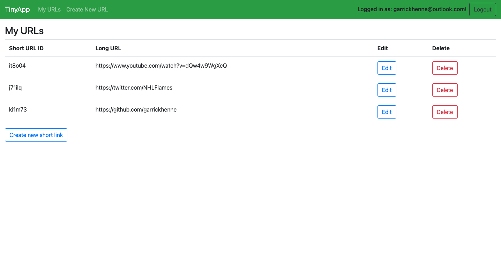
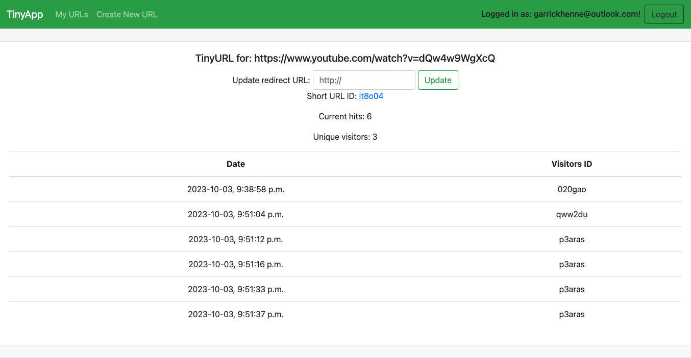
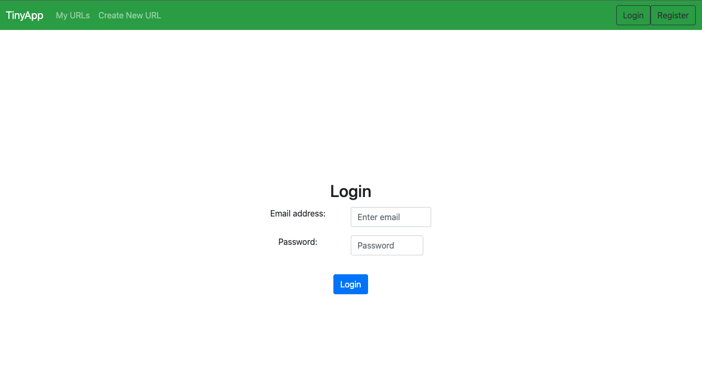

# TinyApp Project

TinyApp is a full stack web application built with Node and Express that allows users to shorten long URLs (à la bit.ly).

## Final Product

## Some cool features
- Retrieves analytics of link usage such as total views, total unique viewers, and a list of times the link was used and by who.
- Link collections are kept by user account to allow private creation but public sharing!

## Dependencies

- Node.js
- Express
- EJS
- bcryptjs
- cookie-session

## Getting Started

- Install all dependencies (using the `npm install` command).
- Run the development web server using the `npm start` command.
